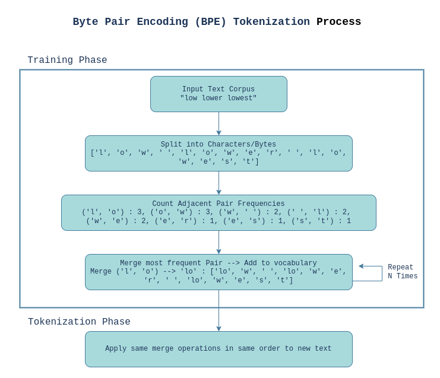

# 🔖 Byte-Pair Encoding (BPE) Tokenizer
A compact Byte-Pair Encoding (BPE) toolkit inspired by Andrew Karpathy’s hands-on style. This repository shows you how to:

- Turn raw text into integer token sequences (and back).
- Build a subword vocabulary by iteratively merging the most frequent symbol pairs.
- Explore implementations in C, Python, and Jupyter Notebook.

<div style="display: flex; flex-direction: column; align-items: center;">

<p style="text-align: center;">Fig. Byte Pair Encoding Process</p>
</div>

## 🚀 What Is Tokenization?

Tokenization is all about breaking text into pieces your model can understand. Think of each character (or word) getting a unique ID. Once you have that mapping, you can convert any sentence into a series of numbers—and back again—like so:

```python
chars = sorted(set(text))                    # every unique character
stoi  = {ch: i for i, ch in enumerate(chars)}  # char → integer
itos  = {i: ch for ch, i in stoi.items()}     # integer → char

def encode(s):
    return [stoi[c] for c in s]

def decode(l):
    return ''.join(itos[i] for i in l)
```

With just these few lines, you’ve built a **character-level** tokenizer. Languages are full of common substrings—“ing,” “tion,”, etc. which would have their own tokens. This is where Byte-Pair Encoding (BPE) shines.

## ✂️ How Byte-Pair Encoding (BPE) Works

BPE discovers frequent subword units by repeating a simple loop:

1. **Count pairs**: Scan your token sequence and count repetition of each adjacent pair `(u, v)` appears.
2. **Select highest-frequency pair**: Find the pair with the highest count.
3. **Merge**: Assign that pair a new token ID and replace every occurrence with this new ID.
4. **Repeat**: Do this `N` times to end up with a vocabulary of size `256 + N` (256 initial bytes plus `N` merges).

This process handles words (by breaking them into smaller pieces) and common words (by merging them into single tokens).

## 🧮 Mathematical Explanation of BPE

- **Start with:**
  
  $V_0 = \{0,1,\ldots,255\}$
  
  $T = [t_1,t_2,\ldots,t_M]$, where $t_j \in V_0$

- **At each iteration** ($i = 1\ldots N$):
  
  1. **Count frequencies:**
     
     $f_i(u,v) = |\{\,j \,|\, (T_j, T_{j+1}) = (u,v)\}|$
  
  2. **Select highest-frequency pair:**
     
     $(u^* , v^* )$ = $pair (u,v)$ with highest frequency $f_i(u,v)$
  
  3. **Merge:**
     
     $w_i = 256 + i$
     
     $T$ ← replace every occurrence of $pair (u^* , v^* )$ in $T$ with $w_i$
     
     $V_i = V_{i-1} \cup \{w_i\}$

**After** ($N$) **merges, your final vocabulary is:**

$|V_N| = 256 + N$

## 📁 Repository Structure

```plaintext
tokenizer/                     # root folder
├── bpe_playground/            # demo apps
│   ├── app/                   # Flask backend
│   │   ├── __init__.py
│   │   ├── app.py
│   │   ├── bpe.py
│   │   └── routes.py
│   └── streamlit_app/         # Streamlit frontend
│       └── app.py
├── en/                        # English BPE examples
│   └── bpe/
│       ├── bpe.c              # tokenizer implementation using C
│       └── bpe.ipynb
├── ne/                        # Nepali tokenizer
│   ├── text.txt
└   └── tokenizer_nepali.py

```

## 🔗 References

- [Byte pair encoding: a text compression scheme that accelerates pattern matching](https://citeseerx.ist.psu.edu/document?repid=rep1&type=pdf&doi=1e9441bbad598e181896349757b82af42b6a6902)
- [minbpe](https://github.com/karpathy/minbpe)
- [Byte Pair Encoding tokenization - HuggingFace](https://huggingface.co/learn/llm-course/en/chapter6/5)
- [Implementing A Byte Pair Encoding (BPE) Tokenizer From Scratch](https://sebastianraschka.com/blog/2025/bpe-from-scratch.html)